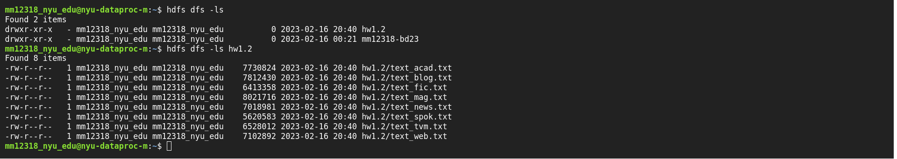
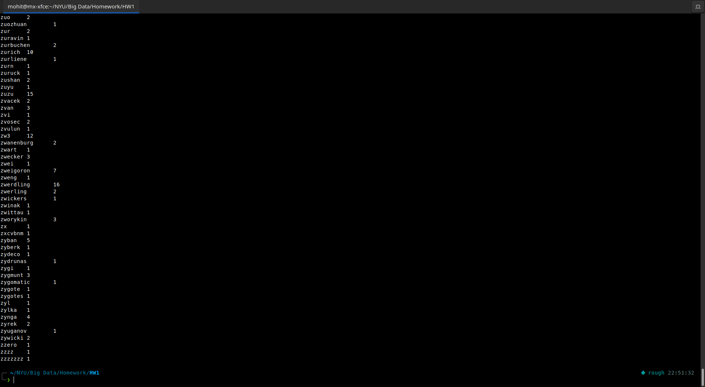
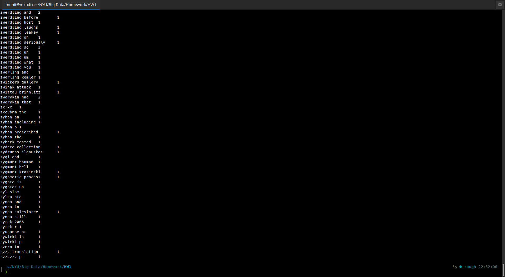
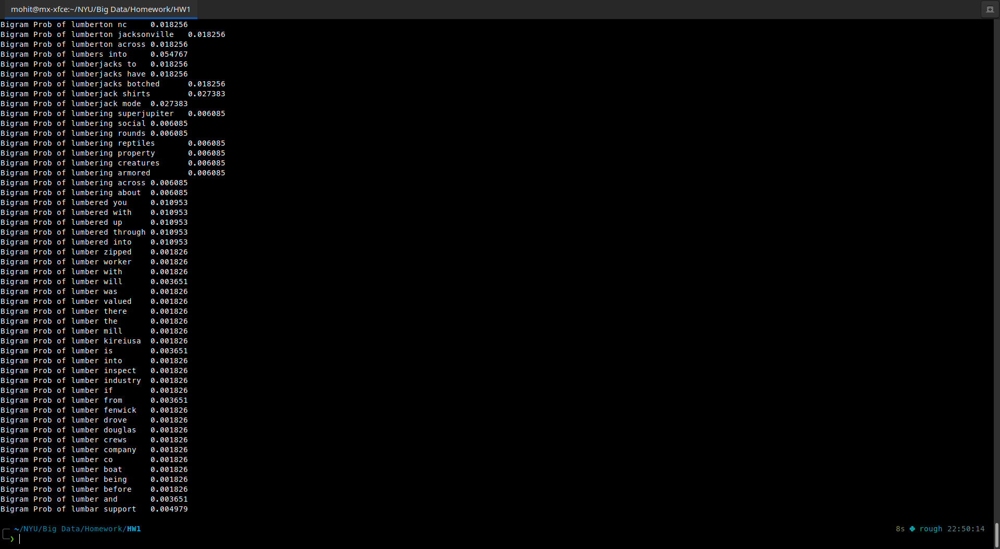
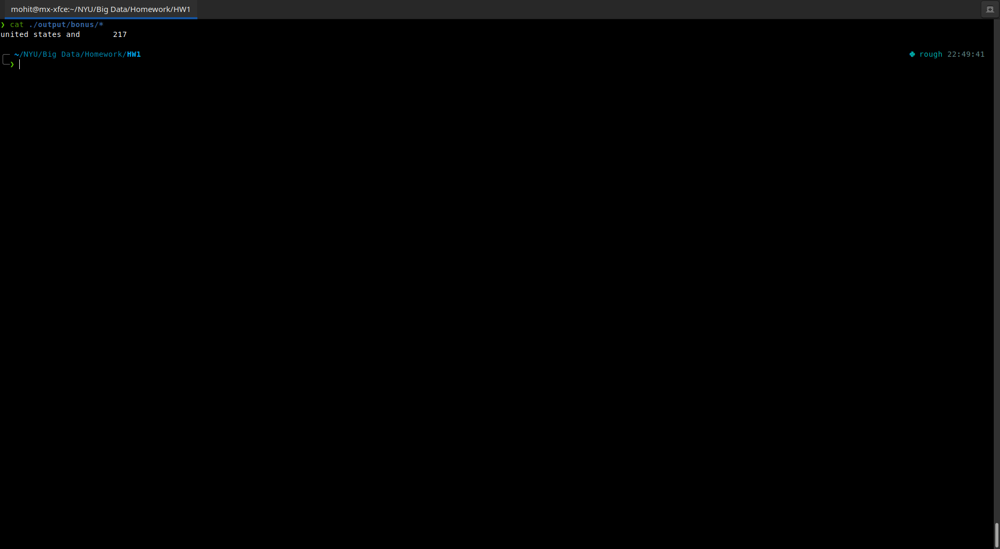

# Homework -1

> Questions are in HW1.pdf

## Q1
Below is the directory listing of hadoop homepage on dataproc


## Q2
For Q2 in order to calculate the $P(w_1|w_2)$, we first need to calcualte $P(w_1,w_2)$ and $P(w_2)$ i.e. the bigram and unigram probablity respectively

In the following implementation, this has been done in 5 Hadoop jobs in a distributed manner

1. Calculating frequency of each unigram (Output Directory: ```output/unigram```):
        
    ```bash
    hdfs dfs -rm -r output/unigram;
    mapred streaming \
    -file /home/mm12318_nyu_edu/HW1/unigram_mapper.py -file /home/mm12318_nyu_edu/HW1/unigram_reducer.py \
    -input hw1.2/* -output output/unigram \
    -mapper "python unigram_mapper.py" -reducer "python unigram_reducer.py";
    ```
    

2. Calculating frequency of each bigram (Output Directory: ```output/bigram```):

    ```bash
    hdfs dfs -rm -r output/bigram;
    mapred streaming \
    -file /home/mm12318_nyu_edu/HW1/bigram_mapper.py -file /home/mm12318_nyu_edu/HW1/unigram_reducer.py \
    -input hw1.2/* -output output/bigram \
    -mapper "python bigram_mapper.py" -reducer "python unigram_reducer.py";
    ```
    

3. Calculating overall unique unigram (Output Directory: ```output/uni_wc```):
    ```bash
    hdfs dfs -rm -r output/uni_wc;
    mapred streaming \
    -file /home/mm12318_nyu_edu/HW1/unigram_wc_mapper.py -file /home/mm12318_nyu_edu/HW1/unigram_wc_reducer.py \
    -input output/unigram/* -output output/uni_wc \
    -mapper "python unigram_wc_mapper.py" -reducer "python unigram_wc_reducer.py";
    ```
    

4. Calculating overall unique bigram (Output Directory: ```output/bi_wc```):
    ```bash
    hdfs dfs -rm -r output/bi_wc ;\
    mapred streaming \
    -file /home/mm12318_nyu_edu/HW1/bigram_wc_mapper.py -file /home/mm12318_nyu_edu/HW1/unigram_wc_reducer.py \
    -input output/bigram/* -output output/bi_wc \
    -mapper "python bigram_wc_mapper.py" -reducer "python unigram_wc_reducer.py";
    ```
    

5. Calculating the conditional probability (Output Directory: ```output/conditional_prob```):
    
    - In the case of conditional probability, we are passing the output of both bigram and unigram as an input to the Hadoop MapReduce (Step 1,2)

    - The input is then passed through the mapper (```./probablity_mapper.py```)
                
        - For unigram, the input is divided as ```word, \t, 1, \t, count``` and then passed to the reducer
        - For bigram, the input is divided as ```word[0], \t, 2, \t, words[1]+' '+count```
        - Therefore after partitioning the mapper output, we get three variables in which the first 2 are used as keys and the last is used as values. More specifically, the first key is used for partitioning, aggregating unigram and bigram together (Eg: the, the cat) and the second key is used for sorting the keys, as we must ensure that the unigram comes before bigram(as 1<2;). 

    - The overall number of unique unigram and bigram are passed as arguments to the reducer (```./probablity_reducer.py```) file, with the value being determined by Step 4 and 5.

    - The reducer then calculates the conditional probability.

    ```bash
    hdfs dfs -rm -r output/bigram_prob;\
    c1=$(hdfs dfs -cat /output/uni_wc/*);c2=$(hdfs dfs -cat /output/bi_wc/*);\
    mapred streaming \
    -D mapred.output.key.comparator.class=org.apache.hadoop.mapred.lib.KeyFieldBasedComparator \
    -D stream.num.map.output.key.fields=2 \
    -D mapred.text.key.partitioner.options=-k1 \
    -D mapred.text.key.comparator.options=-k2,2n \
    -file /home/mm12318_nyu_edu/HW1/probablity_mapper.py -file /home/mm12318_nyu_edu/HW1/probablity_reducer.py \
    -input output/unigram/* -input output/bigram/* -output output/conditional_prob \
    -mapper "python probablity_mapper.py" -reducer "python probablity_reducer.py --uni $c1 --bi $c2";
    ```


## Q3(Extra Credit)
For calculating the max conditional probability $P(w|'united\ states')$ it is sufficient to show calculate the trigram with maximum frequency starting with "united states". 
Output Directory: ```output/bonus```
```bash
hdfs dfs -rm -r output/bonus;\
mapred streaming \
-file /home/mm12318_nyu_edu/HW1/bonus_mapper.py -file /home/mm12318_nyu_edu/HW1/bonus_reducer.py \
-input hw1.2/* -output output/bonus \
-mapper "python bonus_mapper.py" -reducer "python bonus_reducer.py";
```

After running the command, we get trigram as ```united states and``` with frequency of 217.

